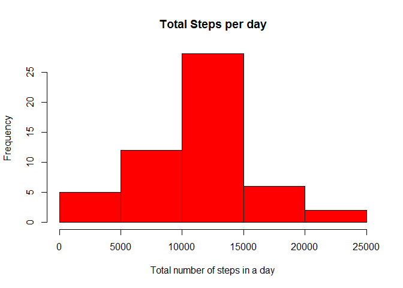
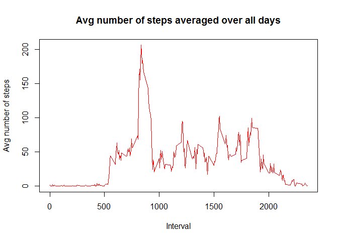
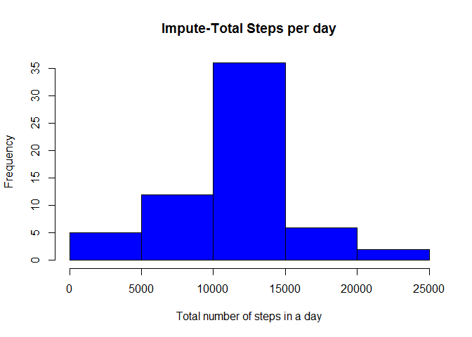
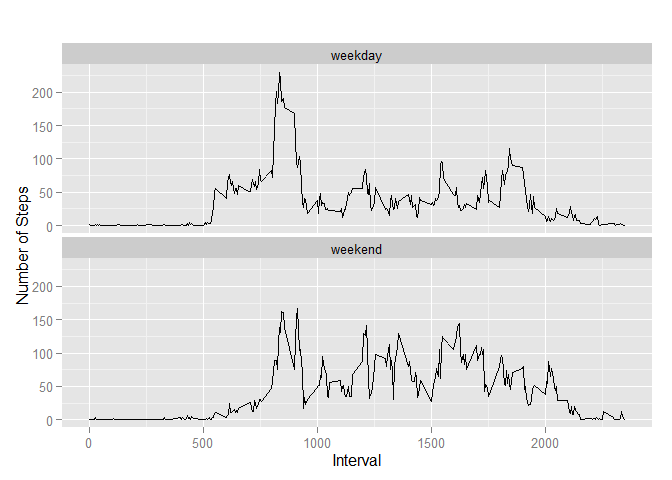

# Reproducible Research: Peer Assessment 1


## Loading and preprocessing the data

```r
library(lubridate)
```

```
## Warning: package 'lubridate' was built under R version 3.2.2
```

```r
library(ggplot2)
```

```
## Warning: package 'ggplot2' was built under R version 3.2.2
```

```r
    setClass('myDate')
    setAs("character","myDate", function(from) as.Date(from, format="%y-%m-%d") )
    activity <- read.csv("activity.csv", colClasses = c("numeric","Date", "numeric"))
```

## What is mean total number of steps taken per day?

```r
    StepsDate <- aggregate(steps ~ date, activity, FUN=sum, na.rm=TRUE)
    hist(StepsDate$steps,main='Total Steps per day',xlab='Total number of steps in a day',col='red')
```

 

```r
    print(mean(StepsDate$steps))     
```

```
## [1] 10766.19
```

```r
    print(median(StepsDate$steps))   
```

```
## [1] 10765
```


## What is the average daily activity pattern? 

```r
    StepsInterval <- aggregate(steps ~ interval, activity, FUN=mean, na.rm=TRUE)
    plot(StepsInterval$interval, StepsInterval$steps, type='l', col='red', main="Avg number of steps averaged over all days", xlab="Interval", ylab="Avg number of steps")
```

 

```r
       ####Which 5-minute interval, on average across all the days in the dataset, contains the maximum number of steps?
    print(StepsInterval [which.max(StepsInterval$steps), ]) 
```

```
##     interval    steps
## 104      835 206.1698
```


## Imputing missing values
Strategy/plan of imputing missing values is commented in the code.

```r
    print(nrow(activity[!complete.cases(activity),])) #get rows with NA's
```

```
## [1] 2304
```

```r
    for (i in 1:nrow(activity)){  ## loop through all the data/row.
        
        if (is.na(activity$steps[i])){    ##Check if a given row has step with NA (missing value)
            
            interval_val <- activity$interval[i]
            row_id <- which(StepsInterval$interval == interval_val)  ## Get the row number with mean for this internal
            activity$steps[i] <- StepsInterval$steps[row_id] ## Assign that row number's mean
        }
    }
    
    StepsDateImpute <- aggregate(steps ~ date, activity, FUN=sum, na.rm=TRUE) ## aggregrate the data which has no missing values
    hist(StepsDateImpute$steps,main='Impute-Total Steps per day',xlab='Total number of steps in a day',col='blue')
```

 

```r
    print(mean(StepsDateImpute$steps))    
```

```
## [1] 10766.19
```

```r
    print(median(StepsDateImpute$steps))   
```

```
## [1] 10766.19
```
Do mean and median values differ from the estimates from the first part of the assignment? 
Answer: mean is same(10766.19) but median is up by 1 (from 10765 to 10766.19)


## Are there differences in activity patterns between weekdays and weekends? Yes.

```r
    activity$dayName <- weekdays(activity$date) ##New column with weekday name assigned
    activity$dayType <- c("weekday") ####Week-Type column added to tell if its weekday or weekend
    for (i in 1:nrow(activity)){
        
        if (activity$dayName[i] == "Saturday" || activity$dayName[i] == "Sunday"){
            activity$dayType[i] <- "weekend"
        }
    }
    
    activity$dayType <- as.factor(activity$dayType) #convert dayType to factor
    
    # Aggregate to get average number of steps in an interval by days
    StepsIntervalImpute <- aggregate(steps ~ interval+dayType, activity, FUN=mean, na.rm=TRUE)
    qplot(interval, steps, data=StepsIntervalImpute, geom=c("line"), xlab="Interval", 
          ylab="Number of Steps", main="") + facet_wrap(~ dayType, ncol=1)
```

 
